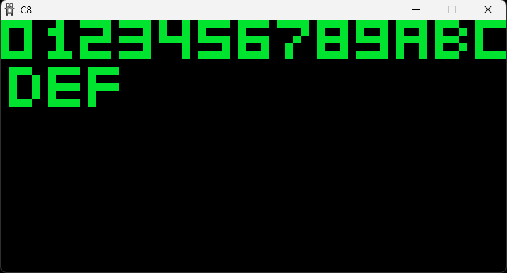
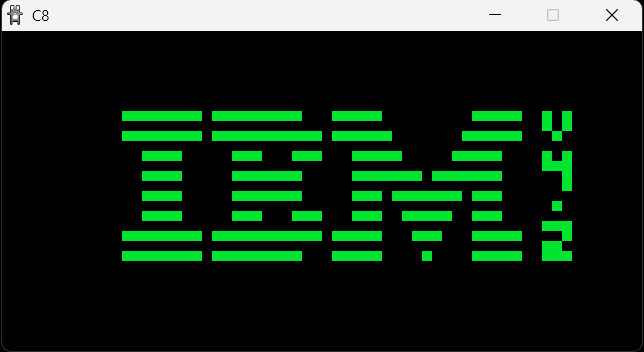

# C8

My attempt at an emudev hello world project, learning C at the same time.

WIP





## Build

From the root of the repo:

Linux:

```bash
cd build && chmod +x ./premake5 && ./premake5 gmake && cd .. && make
```

Windows:

```bash
cd build && ./premake5.exe gmake && cd .. && make
```

## Run

Debug:

```bash
./bin/debug/c8 ./tests/ibm.ch8
```

Release:

```bash
./bin/release/c8 ./tests/ibm.ch8
```

## Tests

Test cartridges are located in `tests`. Most of these were taken from the [https://github.com/Timendus/chip8-test-suite/](https://github.com/Timendus/chip8-test-suite/) repository, which is very much appreciated.
