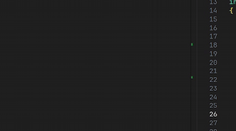
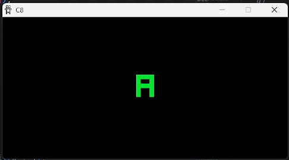
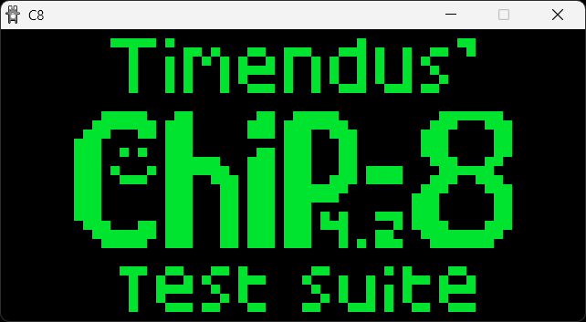
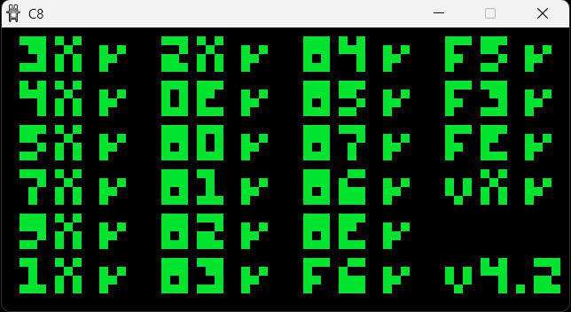
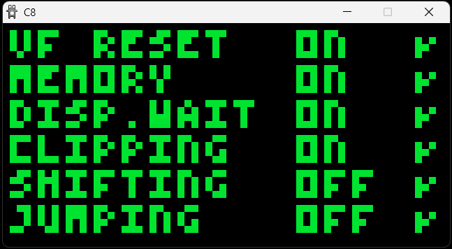
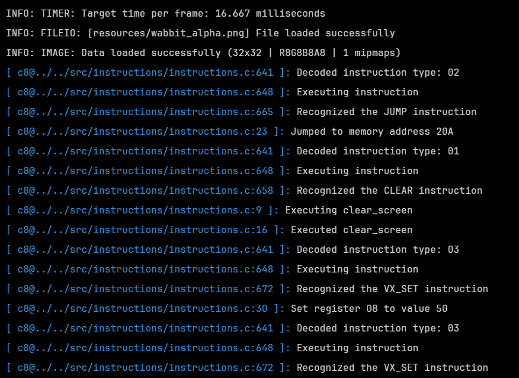

# C8

My attempt at an emudev hello world project, learning C at the same time. Using Raylib.

WIP

<p align="center">
  
  
</p>

<p align="center">
  
  
  
  
</p>

## Build

From the root of the repo, builds in debug configuration by default:

Linux:

```bash
cd build && chmod +x ./premake5 && ./premake5 gmake && cd .. && make
```

Windows:

```bash
cd build && ./premake5.exe gmake && cd .. && make
```

## Run

Debug:

```bash
./bin/Debug/c8 ./tests/ibm.ch8
```

Release:

```bash
./bin/Release/c8 ./tests/ibm.ch8
```

## Tests

Test cartridges are located in `tests`. Most of these were taken from the [https://github.com/Timendus/chip8-test-suite/](https://github.com/Timendus/chip8-test-suite/) repository, which is very much appreciated.

## Resources

Beep sound - [https://bigsoundbank.com/beep-of-a-cash-register-s1417.html](https://bigsoundbank.com/beep-of-a-cash-register-s1417.html)

## TODO

- Keybinds
- Custom assembler?
